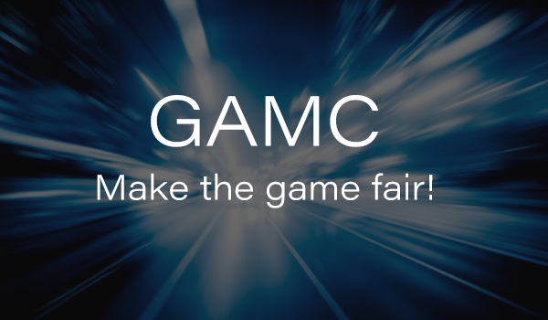

# go-gamc

GAMC is a distributed protocol public blockchain that solves the issues of openness, fairness and transparency through the quantum underlying protocol blockchain technology. The native quantum contract blockchain technology could transform the existing gaming industry and the industries similar to gaming. The demonstrable fairness and auditable algorithms make the gaming industry more innovative. Besides, the GAMC project is supported by a consultant team of six world's top scientists. GAMC will become the most advanced and unique driving engine that focuses on the application of blockchain technology in the gaming industry in the history of global blockchain. In the future, GAMC will definitely generate infinite market value, and is going to change the gaming industry. 